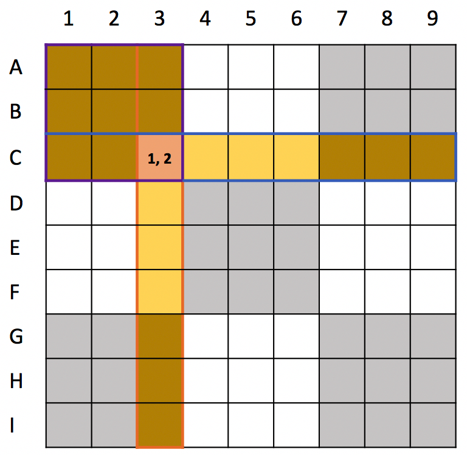
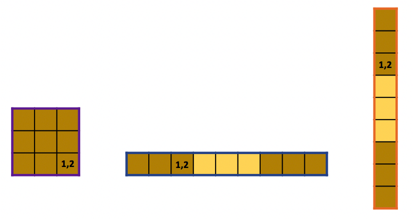
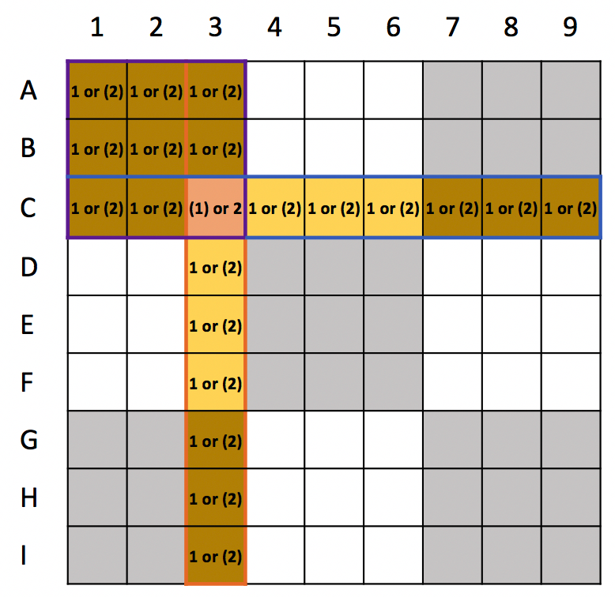
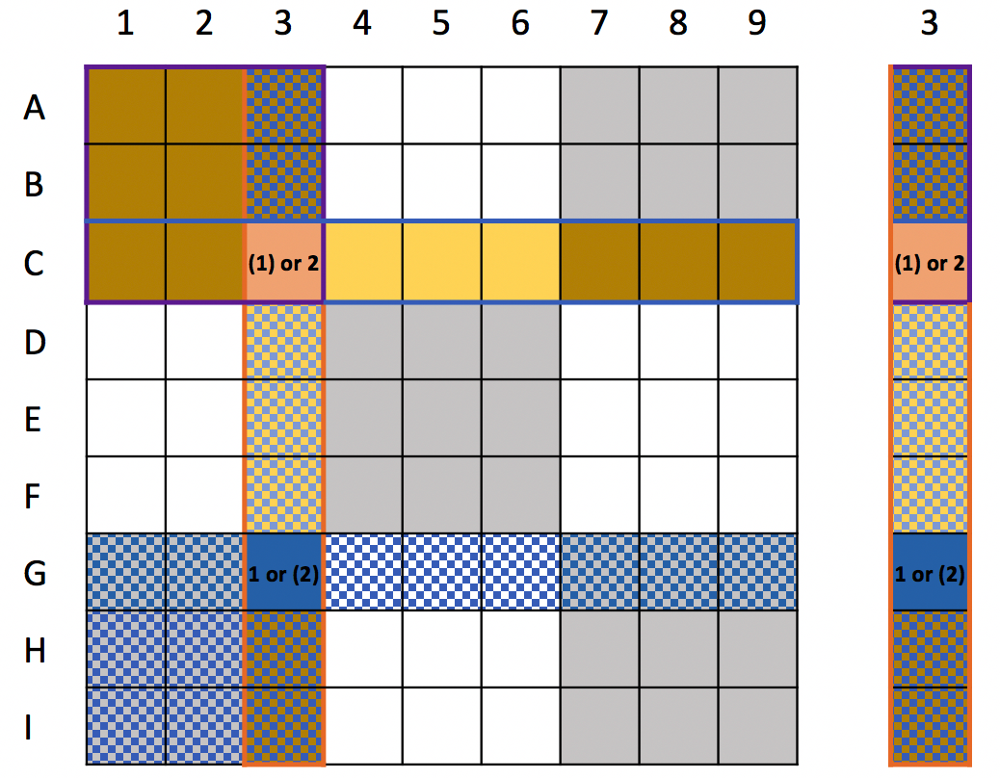

# Artificial Intelligence Nanodegree
## Introductory Project: Diagonal Sudoku Solver

# Question 1 (Naked Twins)
Q: How do we use constraint propagation to solve the naked twins problem?  
A: I will answer to this question with an example.  
Sudoku puzzle has one rule(constraint): each one of 9 boxs in a unit must have a unique single digit number from 1 to 9.
Figure 1-1 shows a typical sudoku board. 


Highlighted in yellow are three types of units (*row*, *column*, and a *9x9 box*), which all together composes a *peer*. Figure 1-2 shows the three types of units (a fourth, diagnoal unit will be introduced in question 2).   


Let's choose an arbitrary box that can only have two possible values, C3 with 1 and 2 as the two possible values shown in Fgirue 1-1. According to the sudoku rule(constraint) we know that if C3 takes either one of the two possible values (say, a one), then all other boxes within its peer can have the other value (in this case, a two) as can be seen in Figure 1-3.  


Constrain propagation comes into play in the naked twins method when there happens to be another box(G3 in Figure 1-4) with the same possible values pair (1, 2) within the peers of the previous box(C3). It is important to note that G3 also has the same constraint: if it takes one of the two possible values, all other boxes within its peer can have the other of the two values.  


These two constraints coming from C3 and G3 overlaps in the region where the two peers overlap (blue/yellow checked column shown on the right side of Figure 1-4). In this region, if C3 takes one of the two values pair, then G3 takes the remaining value. This consequently negate boxes in the overlapping-peers region from having either one of the two values. Thus, we can conveniently erase out the two values from all boxes falling under the overlapping-peers region.  
Propagating constraints to the two boxes, C3 and G3, enforced some values to be eliminated from the board and get closer to the final answer of the sudoku game.

# Question 2 (Diagonal Sudoku)
Q: How do we use constraint propagation to solve the diagonal sudoku problem?  
A: Diagonal Sudoku problem introduces an additional constraint to consider. This is beneficial in terms of using constraint propagation for solving sudoku puzzle because now more values fall under the constraints(or conditions to be eliminated) of each elimination method. Therefore more values are eliminated, and in turn, more constraints are introduced in other parts of the board (TODO: graph substantiating this point).

### Install

This project requires **Python 3**.

We recommend students install [Anaconda](https://www.continuum.io/downloads), a pre-packaged Python distribution that contains all of the necessary libraries and software for this project.
Please try using the environment we provided in the Anaconda lesson of the Nanodegree.

##### Optional: Pygame

Optionally, you can also install pygame if you want to see your visualization. If you've followed our instructions for setting up our conda environment, you should be all set.

If not, please see how to download pygame [here](http://www.pygame.org/download.shtml).

### Code

* `solutions.py` - You'll fill this in as part of your solution.
* `solution_test.py` - Do not modify this. You can test your solution by running `python solution_test.py`.
* `PySudoku.py` - Do not modify this. This is code for visualizing your solution.
* `visualize.py` - Do not modify this. This is code for visualizing your solution.

### Visualizing

To visualize your solution, please only assign values to the values_dict using the ```assign_values``` function provided in solution.py

### Data

The data consists of a text file of diagonal sudokus for you to solve.
